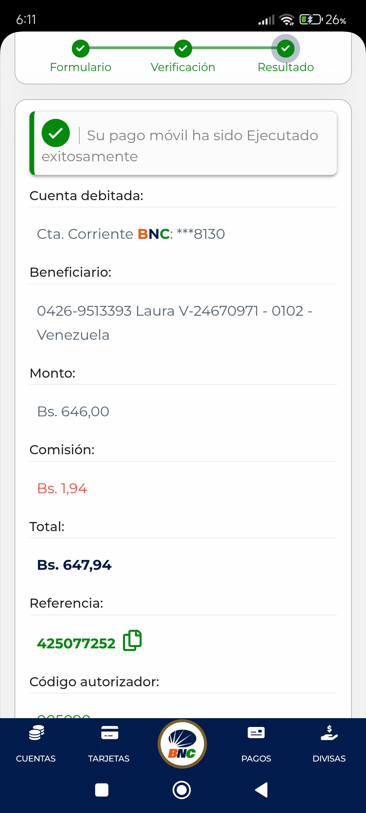

# ChainVibe - Clanker Token Tracker

ChainVibe is a web application designed to explore and analyze Clanker tokens on the Base blockchain. It provides tools to track token data, monitor project performance, and visualize trading activity, making it easier for users to understand Clanker's reward distribution and token ecosystem.

## Features
- **Token Exploration**:
  - Search tokens by name or symbol.
  - Filter tokens by creation date (All Dates, Last 7 Days, Last 30 Days).
  - Filter tokens by type (All Types, Clanker V3.1).
  - Filter tokens by name length (All Lengths, >10 chars, >20 chars).
  - Sort tokens by name, symbol, or creation date.
- **Basic Stats**:
  - Latest token by creation date.
  - Token with the longest name.
  - Project with the highest trading volume.
- **Project & Rewards Tracking**:
  - Track trading volume, creator earnings (40% of 1% swap fees), and reward status (Claimed/Not Claimed) for each token.
  - Data sourced from Basescan API and Clanker’s public endpoint.
- **Interactive Visualization**:
  - Bar chart displaying trading volume per token using Chart.js.
- **Additional Tools**:
  - Export project data to CSV.
  - Toggle between light and dark themes.
  - Pagination for token navigation.
  - Toast notifications for user actions.
  - Scroll-to-top button.
  - Local caching for faster loading.
  - Clear filters button to reset all filters.
  - Mobile-friendly design.

## Live Demo
Check out the live demo here: [ChainVibe Live](https://esospanas.github.io/ChainVibe-/)

## Screenshot

## Getting Started
1. Clone this repository: `git clone https://github.com/EsoSPanas/ChainVibe-.git`
2. Open `index.html` in your browser to view the application locally.
3. Explore Clanker tokens, analyze project performance, and interact with the volume chart.

## Data Sources
- **Token List**: `https://www.clanker.world/api/tokens`
- **Volume & Rewards**: Basescan API (requires an API key for real-time data).

## Contributing
Feedback and contributions are welcome! Feel free to open an issue or submit a pull request.