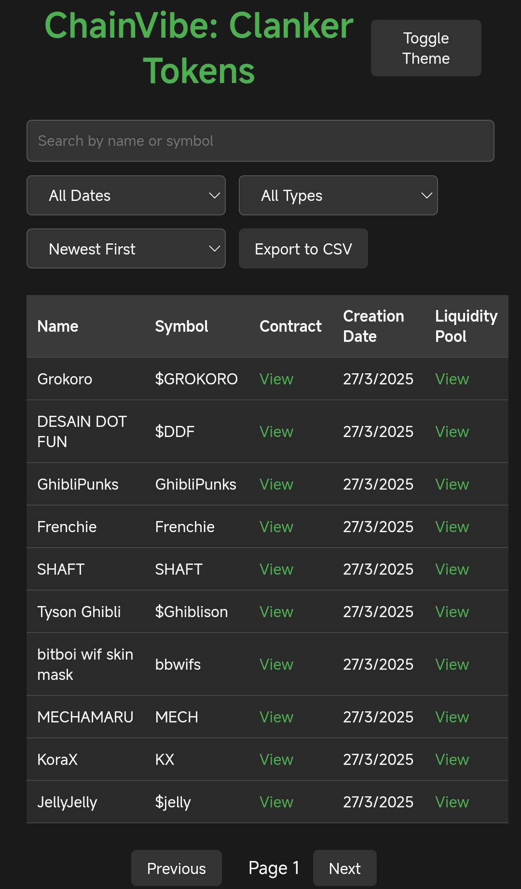

# ChainVibe - Clanker Token Tracker

ChainVibe is a web application designed to explore Clanker tokens on the Base blockchain. It allows users to search, filter, sort, and export token data, making it easier to track and analyze tokens.

## Features
- Search tokens by name or symbol
- Filter tokens by creation date (All Dates, Last 7 Days, Last 30 Days)
- Filter tokens by type (All Types, Clanker V3.1)
- Filter tokens by name length (All Lengths, >10 chars, >20 chars)
- Sort tokens by name, symbol, or creation date
- View basic stats: latest token and longest name
- Export filtered tokens to CSV
- Toggle between light and dark themes
- Pagination to navigate through token pages
- Toast notifications for user actions
- Scroll-to-top button for better navigation
- Local caching for faster data loading
- Clear filters button to reset all filters
- Mobile-friendly design

## Live Demo
Check out the live demo here: [ChainVibe Live](https://esospanas.github.io/ChainVibe-/)

## Screenshot

## Getting Started
1. Clone this repository: `git clone https://github.com/EsoSPanas/ChainVibe-.git`
2. Open `index.html` in your browser to view the application locally.
3. Explore Clanker tokens and use the filters to customize your view.

## Contributing
Feedback and contributions are welcome! Feel free to open an issue or submit a pull request.